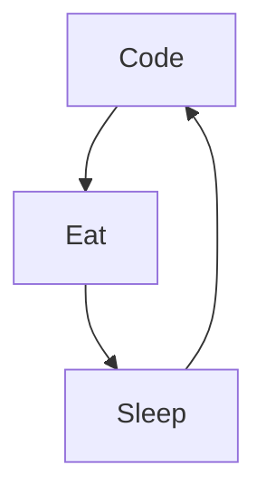

<!---
Roulian1/Roulian1 is a ✨ special ✨ repository because its `README.md` (this file) appears on your GitHub profile.
You can click the Preview link to take a look at your changes.
--->
# Julien Elinckx/Junior Web Developper

- 👋 Hi, I’m Julien Elinckx
- 👀 I’m interested in coding 
- 🌱 I’m currently learning to be a junior web developper @BeCode.org
- 💞️ I’m looking to collaborate on ...(still to define, but I would be more interested with the backend)
- 📫 How to reach me on [hotmail](https://www.julienelinckx@hotmail.com)

---
### My formidable team at Becode:
.jpg)

---
### Connect with me:

 
 

---
### Languages and Tools:

 
 

---
### My daily routine :

---
### ⭐ GitHub Stats

<!-- ### 🔥 Recent GitHub Activity -->
<!--START_SECTION:activity-->

<!--END_SECTION:activity-->

